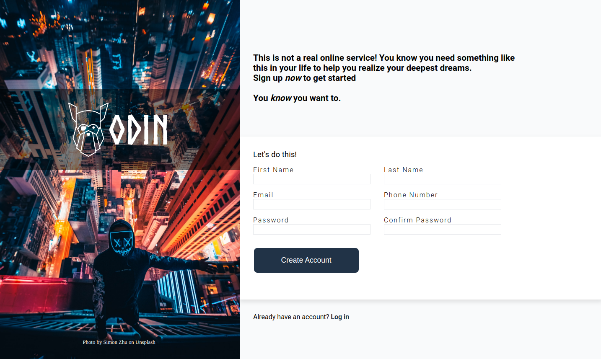

# Sign Up Form - The Odin Project

This is a solution to the [Project: Sign-Up Form](https://www.theodinproject.com/lessons/node-path-intermediate-html-and-css-sign-up-form) of the Odin Project.

## Table of contents

- [Overview](#overview)
  - [The challenge](#the-challenge)
  - [Screenshot](#screenshot)
  - [Links](#links)
- [My process](#my-process)
  - [Built with](#built-with)
  - [What I learned](#what-i-learned)
- [Author](#author)

## Overview

### The challenge

Create a form for an imaginary service. In this project I use different things that I have been studying in The Odin Project curriculum.

Users should be able to:

- View the optimal layout depending on their device's screen size
- See hover states for interactive elements
- Valide the information that send

### Screenshot

### Links

- Live Site URL: https://leon2610.github.io/sign-up-form-TOP/

## My process

### Built with

- Semantic HTML5 markup
- CSS custom properties
- Flexbox
- Form Elements
- Pseudoclases: hover and focus
- A little of JavaScript for the validation

### What I learned

* Positioning elements with flexbox and CSS
* Working with various CSS properties
* To work with inputs in forms and validate them
* To include an external font

## Author

- Github - [Leonel León](https://github.com/Leon2610)
- Twitter - [@LeoDev26](https://twitter.com/LeoDev26)